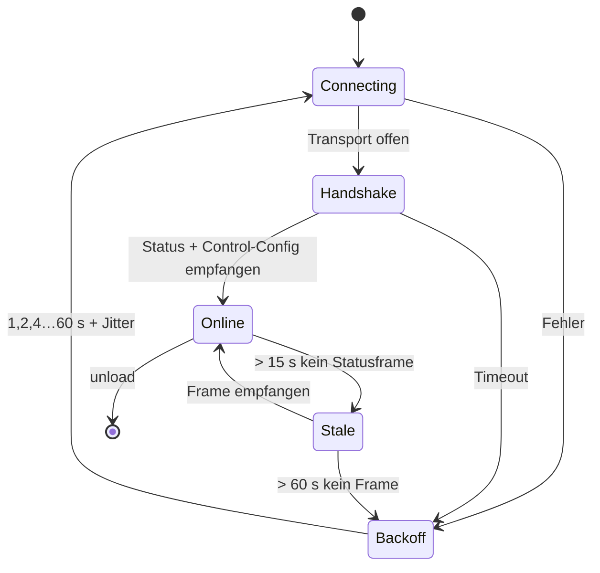

# 02 — Architektur

## 1. Gesamtbild

```
Home Assistant
└── custom_components/balboa_link/
    ├── Plattformen        climate · water_heater · switch · fan · light ·
    │                      select · number · sensor · binary_sensor · event · time · button
    ├── entity.py          gemeinsame Basisklasse (DeviceInfo, Verfügbarkeit, Push)
    ├── config_flow.py     Einrichtung, Discovery, Rekonfiguration, Optionen
    ├── diagnostics.py     Diagnose-Download
    └── balboa/            ← eigenständige Protokollbibliothek, HA-frei
        ├── transport/     TcpTransport · SerialTransport · Rfc2217Transport
        ├── framing.py     Frame-Erkennung, CRC-8, Serialisierung
        ├── messages.py    typisierte Nachrichten, Parser
        ├── arbitration.py Sendestrategie (sofort / Token-gebunden)
        ├── client.py      Zustandsmaschine, Reconnect, Events
        └── discovery.py   UDP-Broadcast auf 30303
```

**Leitprinzip: strikte Trennung.** Das Paket `balboa/` kennt Home Assistant nicht —
kein Import aus `homeassistant.*`. Es ist mit reinem `pytest` gegen aufgezeichnete
Byteströme testbar und ließe sich später unverändert auf PyPI veröffentlichen.
Die HA-Schicht darüber enthält keine Protokolllogik.

## 2. Warum eine eigene Protokollbibliothek

Die Alternative wäre `pybalboa` als Abhängigkeit. Dagegen sprechen zwei strukturelle Gründe:

1. `pybalboa` verbindet sich fest über `asyncio.open_connection(host, port)`. Serielle
   Transporte erforderten das Überschreiben privater Attribute (`_reader`, `_writer`) —
   eine Kopplung an Interna, die bei jedem Release brechen kann.
2. `_check_configuration_loaded()` verlangt zwingend `_module_identification_loaded`.
   Genau diese Bedingung ist für Aufbauten ohne WLAN-Modul potenziell nicht erfüllbar
   (siehe [01-analyse.md](01-analyse.md), Abschnitt 3).

Dafür spricht: Das Protokoll ist klein, vollständig dokumentiert und seit Jahren
unverändert — reverse-engineert an einer Hardware, die keine Updates erhält. Die Bibliothek
umfasst geschätzt 900–1200 Zeilen und ist damit gut beherrschbar.

> **Ausdrücklich vorgesehen:** Sollte `pybalboa` künftig eine Transport-Abstraktion
> erhalten, ist ein Wechsel möglich, weil `balboa/client.py` hinter einer schmalen
> Schnittstelle liegt. Ein Beitrag der hiesigen Transport-Abstraktion an `pybalboa` wäre
> die sauberste Auflösung und ist als Option ausdrücklich offen.

## 3. Transport-Abstraktion

```python
class Transport(Protocol):
    async def connect(self) -> None: ...
    async def read(self, n: int) -> bytes: ...
    async def write(self, data: bytes) -> None: ...
    async def close(self) -> None: ...

    @property
    def default_arbitration(self) -> ArbitrationMode: ...
    @property
    def identity_hint(self) -> str: ...   # z. B. "10.0.0.5:4257" oder "/dev/ttyUSB0"
```

| Transport | Ziel-Hardware | Standard-Port | Arbitrierung (Vorgabe) |
|---|---|---|---|
| `TcpTransport` | Balboa-WLAN-Modul | 4257 | sofort |
| `TcpTransport` | EW11, ser2net, ESPHome-Serial-Server | 8899 | sofort |
| `SerialTransport` | USB-/GPIO-RS-485-Adapter | — (115200 8N1) | Token-gebunden |
| `Rfc2217Transport` | rfc2217-fähige Gateways | 23 | Token-gebunden |

Ein einziger Transport (`TcpTransport`) deckt damit sowohl das originale WLAN-Modul als
auch die EW11-Lösung ab — sie unterscheiden sich nur im Port. Das ist der Kern der
Kompatibilität und kostet keine Sonderbehandlung.

`Rfc2217Transport` ist als Phase-2-Ziel vorgesehen; laut
[Issue #73](https://github.com/ccutrer/balboa_worldwide_app/issues/73) verhalten sich manche
EW11-Firmwares nicht rfc2217-konform, weshalb TCP-Server-Modus die empfohlene
EW11-Betriebsart bleibt.

## 4. Sendestrategie (Arbitrierung)

```python
class ArbitrationMode(StrEnum):
    IMMEDIATE = "immediate"   # sofort schreiben
    TOKEN     = "token"       # erst nach Empfang von "Ready" (10 BF 06)
```

- `IMMEDIATE` — Schreiben geht direkt raus. Belegter Normalfall für WLAN-Modul und
  TCP-Gateways.
- `TOKEN` — ausgehende Frames landen in einer `asyncio.Queue`; der Empfangs-Task schreibt
  genau einen Frame, sobald ein `Ready` eintrifft. Verhindert Buskollisionen bei direktem
  RS-485-Anschluss.

Die Vorgabe kommt vom Transport, ist aber in den Integrationsoptionen überschreibbar —
für den Fall, dass ein Aufbau wider Erwarten Kollisionen zeigt. **Sicherheitsnetz:** Läuft
im `TOKEN`-Modus 30 Sekunden lang kein `Ready` ein, wird einmalig gewarnt und ein
HA-Reparaturhinweis erzeugt, der auf `IMMEDIATE` verweist — statt stillschweigend nie zu
senden.

## 5. Verbindungslebenszyklus



- **Handshake:** Nach dem Verbindungsaufbau werden Konfigurationsanfragen gestellt und auf
  das erste `Status`- und `ControlConfiguration`-Paket gewartet. **Nur diese beiden sind
  Pflicht** — anders als bei `pybalboa` ist die Modul-Identifikation *optional*. Genau
  hier liegt der Unterschied, der EW11-Aufbauten überhaupt erst funktionieren lässt.
- **Backoff:** exponentiell `min(2^n + jitter, 60 s)` — übernommen aus `pybalboa`, dort
  bewährt.
- **Stale-Erkennung:** Die Steuerung sendet sekündlich. Bleiben Frames aus, obwohl der
  Socket offen ist (klassisch bei einem eingefrorenen EW11), werden die Entities auf
  *nicht verfügbar* gesetzt und die Verbindung neu aufgebaut. Ein reiner
  Socket-Zustandstest würde das nicht bemerken.

## 6. Datenfluss in HA

```
Transport ──bytes──▶ FrameReader ──Frame──▶ MessageParser ──Message──▶ SpaState
                                                                          │
                                                          Event "update"  ▼
                                                    async_write_ha_state (pro Entity)
```

- Kein `DataUpdateCoordinator`: Die Steuerung **pusht** sekündlich, Polling wäre falsch.
  `iot_class: local_push`, `_attr_should_poll = False`, Entities abonnieren im
  `async_added_to_hass` ein Update-Event (Muster der Core-Integration).
- `SpaState` ist ein eingefrorener Datenklassen-Schnappschuss. Entities lesen daraus,
  schreiben nie hinein.
- Schreibbefehle laufen über `SpaClient.send(...)` und werden **nicht** optimistisch in den
  Zustand gespiegelt; die Bestätigung kommt mit dem nächsten Statusframe (< 1 s).
  Ausnahme: Toggle-Befehle für mehrstufige Pumpen, wo die Zwischenstufe kurz optimistisch
  gesetzt wird, damit die Oberfläche nicht zurückspringt.

## 7. Konfigurationsmodell

**`entry.data`** (unveränderlich, identitätsrelevant):
```python
{
  "transport": "tcp" | "serial" | "rfc2217",
  "host": "10.0.0.5",        # tcp/rfc2217
  "port": 4257,
  "device": "/dev/ttyUSB0",  # serial
  "mac": "00:15:27:aa:bb:cc" # optional, wenn ermittelt
}
```

**`entry.options`** (jederzeit änderbar, ohne Identitätswirkung):
```python
{
  "arbitration": "auto" | "immediate" | "token",
  "sync_time": False,
  "temperature_precision": "auto",
}
```

Der **Anzeigename** liegt bewusst in **keinem** von beiden: Er ist der `title` des Config
Entry und damit über *Einstellungen → Geräte & Dienste → Umbenennen* frei änderbar, ohne
dass eine Entity ihre Identität verliert.

## 8. Fehlerbehandlung

| Situation | Verhalten |
|---|---|
| Verbindung beim Setup nicht möglich | `ConfigEntryNotReady` → HA wiederholt automatisch |
| Verbindung im Betrieb verloren | Entities `available = False`, Reconnect mit Backoff |
| Frames mit falschem CRC | verwerfen, `debug`-Log, Zähler in der Diagnose |
| Unbekannter Nachrichtentyp | verwerfen, `debug`-Log, Zähler — nie Absturz |
| `TOKEN`-Modus ohne `Ready` | Reparaturhinweis mit Handlungsempfehlung |
| Serieller Port belegt/verschwunden | `ConfigEntryNotReady`, Reparaturhinweis |

Grundsatz: **Ein unerwartetes Byte darf niemals die Integration beenden.** Der Parser ist
defensiv, jeder Frame wird einzeln validiert, und der Empfangs-Task fängt Ausnahmen pro
Frame ab.
