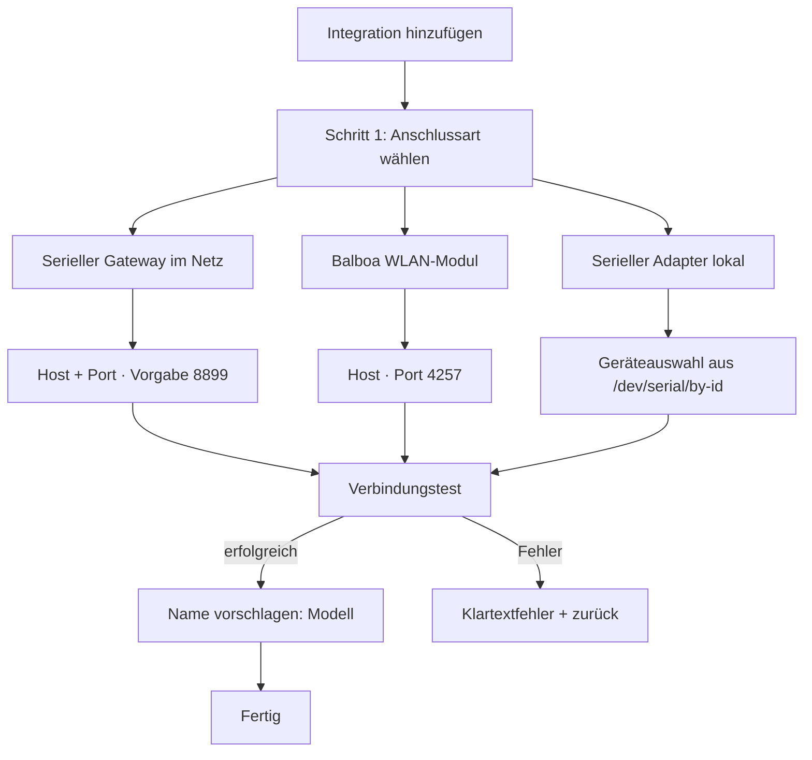

# 05 — Benutzerführung und Config Flow

## 1. Installationsweg

Über HACS als Custom Repository, danach *Einstellungen → Geräte & Dienste →
Integration hinzufügen → Balboa SPAcentral*. Kein Add-on, kein Container, kein MQTT-Broker.

## 2. Einrichtung

Der serielle Gateway steht bewusst an erster Stelle — er ist der Aufbau, für den diese
Integration entsteht, und der einzige, den bestehende Lösungen nicht bedienen.

### Schritt 1 — Anschlussart

Drei Kacheln in Alltagssprache, nicht in Protokollbegriffen:

| Auswahl | Beschreibung im Dialog | Technisch |
|---|---|---|
| **Balboa WLAN-Modul** | „Das originale WLAN-Modul von Balboa (bwa, Modell 50350)" | TCP, Port 4257 fest vorbelegt |
| **Serieller Gateway im Netzwerk** | „Ein Adapter wie Elfin EW11, ser2net oder ESPHome, der den RS-485-Anschluss ins Netzwerk bringt" | TCP, Port abfragen (Vorgabe 8899) |
| **Serieller Adapter lokal** | „Ein USB- oder GPIO-RS-485-Adapter direkt am Home-Assistant-Rechner" | Serieller Port, 115200 8N1 |

Die Anschlussart bestimmt nur die Vorbelegung von Port und Arbitrierung — sie ist keine
getrennte Codebasis.

### Schritt 2 — Parameter

Pro Anschlussart nur die tatsächlich nötigen Felder. Der serielle Port wird als
**Auswahlliste** aus `/dev/serial/by-id` angeboten, nicht als Freitext — `by-id`-Pfade sind
im Gegensatz zu `/dev/ttyUSB0` über Neustarts stabil.

### Schritt 3 — Verbindungstest

Es wird tatsächlich verbunden und auf einen Statusframe gewartet, bevor der Eintrag
angelegt wird. Ergebnis: Modellbezeichnung als Namensvorschlag, MAC falls verfügbar.

Fehler werden im Klartext gemeldet, mit Handlungshinweis:

| Fehler | Meldung |
|---|---|
| `cannot_connect` | „Keine Verbindung zu {host}:{port}. Prüfe IP und Port; beim EW11 muss der TCP-Server-Modus aktiv sein." |
| `no_frames` | „Verbunden, aber es kommen keine Daten. Beim EW11: Baudrate 115200, 8N1 prüfen. Bei serieller Verbindung: A/B-Leitungen vertauscht?" |
| `port_busy` | „Der serielle Port wird bereits von einem anderen Dienst verwendet." |
| `already_configured` | „Dieses Spa ist bereits eingerichtet." |

Der zweite Fall ist der wertvollste — „verbunden, aber stumm" ist der häufigste
EW11-Fehlaufbau und wird sonst nirgends erklärt.

## 3. Name und Mehrfachinstanz

Der Name ist der **Titel des Config Entry**. Er wird nach dem Verbindungstest mit dem
erkannten Modell vorbelegt und ist im Dialog frei überschreibbar — genau die
Installationsabfrage, die im MQTT-Weg fehlt.

Mehrere Instanzen sind der Normalfall: jede Anlage ein Config Entry. Duplikate werden über
Host+Port beziehungsweise Gerätepfad abgefangen. **Es gibt keine künstliche Grenze und
keine Slug-Akrobatik** — das ist der strukturelle Vorteil einer Integration gegenüber einem
Add-on.

Umbenennen später: *Einstellungen → Geräte & Dienste → Umbenennen*, wirkungslos für die
Entity-Identität (siehe [03-geraeteidentitaet.md](03-geraeteidentitaet.md)).

## 4. Discovery — auf später verschoben

Zwei Verfahren wären möglich, beide **ausschließlich für das Balboa-WLAN-Modul**:

| Quelle | Wirkung |
|---|---|
| **UDP 30303** Broadcast | gefundene Module werden zur Bestätigung angeboten, MAC inklusive |
| **DHCP** (`macaddress: 001527*` im Manifest) | HA schlägt neu aufgetauchte Module von selbst vor |

Für Gateway- und Serienaufbauten gibt es hardwarebedingt keine Discovery: Der Adapter trägt
die MAC seines eigenen Herstellers und ist eine generische Brücke ohne Balboa-Kennung.

**Beides ist nicht Teil des Erstumfangs.** Ohne WLAN-Modul zum Testen wäre es Code, der in
fremden Installationen ungefragt Einrichtungsvorschläge erzeugt, ohne je verifiziert worden
zu sein. Nachgezogen wird es, sobald jemand mit passender Hardware testen kann; die
Anknüpfungspunkte im Config Flow (`async_step_dhcp`, `async_step_integration_discovery`)
sind im Entwurf vorgesehen.

## 5. Optionen (nachträglich änderbar)

| Option | Vorgabe | Zweck |
|---|---|---|
| Uhrzeit synchronisieren | aus | stündlicher Abgleich der Spa-Uhr mit HA |
| Sendeverfahren | automatisch | `automatisch` / `sofort` / `token-gebunden` — nur für Problemfälle |
| Pumpen als Lüfter darstellen | an | aus = einstufige Pumpen als `switch` |

Bewusst **nicht** vorhanden: ein Abfrageintervall. Die Steuerung pusht sekündlich; ein
Intervall wäre eine Scheinoption.

## 6. Rekonfiguration

Ein `async_step_reconfigure` erlaubt das Ändern von Host, Port und Gerätepfad, **ohne** den
Eintrag zu löschen — wichtig beim Wechsel der EW11-IP oder beim Umstieg vom WLAN-Modul auf
einen Gateway. Die Identität bleibt dabei erhalten, die Entities bleiben bestehen.

## 7. Diagnose

`diagnostics.py` liefert einen Download mit: Transportart, Host/Port (Host anonymisiert),
Arbitrierungsmodus, erkannter Konfiguration (Anzahl Pumpen/Lichter/Aux), Firmware- und
Modellangaben, Zählern für empfangene Frames, CRC-Fehler und unbekannte Nachrichtentypen,
sowie den letzten 20 Rohframes in Hex. Das macht Fehlerberichte ohne Rückfragen auswertbar.

MAC-Adresse und Host werden über `async_redact_data` unkenntlich gemacht.
